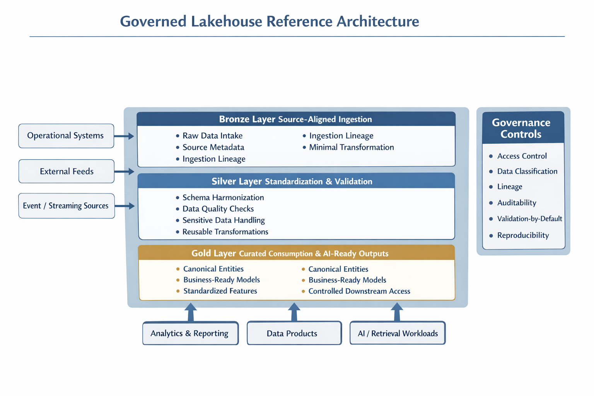
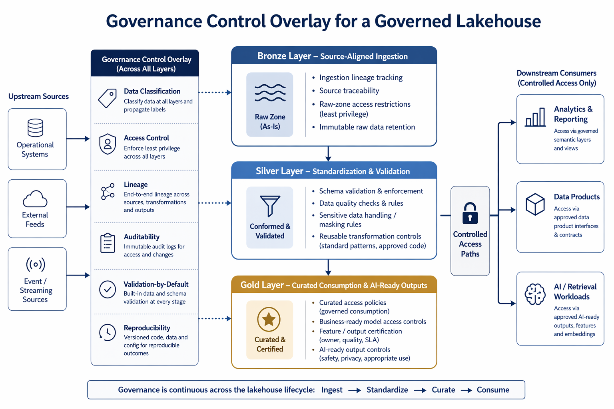

# Governed Lakehouse Architecture

## Overview

This repository documents a reference architecture for building governed lakehouse platforms in regulated environments such as healthcare.

The focus is not just on storing and processing data. It is on designing a platform that embeds governance, auditability, controlled access, and reusable delivery patterns into the architecture from the start.

This is intended as an architecture portfolio repository. The emphasis is on design principles, control points, architectural tradeoffs, and reusable patterns rather than code-heavy implementation.

## Why This Matters

Many data platforms scale ingestion and transformation before they scale governance. That usually creates the same downstream problems:

- fragmented access control
- inconsistent data quality enforcement
- weak lineage and auditability
- one-off ingestion and transformation logic
- rework when AI, analytics, or compliance requirements expand

A governed lakehouse architecture addresses that by treating governance as a platform capability, not an afterthought.

## Architecture Goals

This architecture is designed to support:

- scalable ingestion across multiple domains and source systems
- governed transformation and consumption patterns
- policy-aligned handling of sensitive and regulated data
- strong auditability, lineage, and reproducibility
- reusable standards that enable cross-team adoption
- readiness for advanced analytics and AI workloads

## Core Principles

### 1. Governance by Design
Governance should be embedded into the platform architecture, not applied later through manual controls or disconnected review processes.

### 2. Reusable Patterns over One-Off Pipelines
The platform should standardize ingestion, validation, transformation, and access models so teams can scale consistently.

### 3. Clear Layer Responsibilities
Each layer in the lakehouse should have a defined purpose, ownership model, and control boundary.

### 4. Metadata-Driven Control
Policies, classifications, validation rules, and access decisions should be driven by metadata and declarative standards wherever possible.

### 5. AI Readiness Requires Governed Foundations
AI and retrieval-based use cases depend on well-governed source data, lineage, access boundaries, and explainable data flows.

## Reference Architecture Diagram

## Reference Layering Model

### Bronze Layer
Purpose:
- source-aligned ingestion
- raw or near-raw persistence
- lineage capture
- traceability to original systems

Typical characteristics:
- immutable or append-oriented ingestion where possible
- source metadata captured at load time
- minimal transformation
- ingestion timestamps, batch identifiers, and source system references

### Silver Layer
Purpose:
- standardization
- validation
- conformity checks
- governed transformations

Typical characteristics:
- schema normalization
- data quality enforcement
- field harmonization
- handling of sensitive data according to policy
- reusable transformation logic across domains

### Gold Layer
Purpose:
- business-ready, governed consumption
- canonical entities
- curated analytics and AI-ready outputs

Typical characteristics:
- business-aligned data models
- stable consumption structures
- derived metrics and standardized features
- controlled access for downstream use cases
- support for reporting, analytics, and AI workflows

## Governance Control Overlay

This view highlights how governance is enforced across the lakehouse as a platform capability rather than a downstream control layer.

While the reference architecture defines how data flows across Bronze, Silver, and Gold layers, this overlay focuses on **where and how controls are applied**, including:

- data classification and sensitivity handling
- role-based and domain-aware access control
- lineage and traceability across transformations
- validation-by-default data quality enforcement
- auditability and reproducibility of platform operations

Each layer applies these controls differently based on its role:

- **Bronze** emphasizes source traceability, ingestion lineage, and restricted raw access  
- **Silver** enforces schema standardization, validation, and policy-aligned data handling  
- **Gold** focuses on curated access, governed consumption, and readiness for analytics and AI  

For a more detailed explanation of the control model, see:  
[Governance Control Model](docs/governance-control-model.md)

## Cross-Cutting Governance Controls

The architecture should enforce governance across all layers, not only at the point of consumption.

### Access Control
- role-based access control
- least privilege
- domain-aware permissions
- separation of raw, curated, and sensitive access paths

### Data Classification
- sensitive data identification
- regulated data handling rules
- masking, de-identification, or tokenization patterns as required

### Lineage and Auditability
- traceability from source to consumption
- transformation visibility
- run-level execution records
- explainable movement of critical data elements

### Validation by Default
- schema checks
- completeness checks
- integrity and conformity checks
- threshold-based quality gates where applicable

### Reproducibility
- versioned logic
- repeatable execution patterns
- controlled schema evolution
- auditable operational runs

## Architectural Building Blocks

A governed lakehouse typically includes the following building blocks:

- ingestion framework
- metadata and control tables
- validation framework
- transformation standards
- curated domain models
- policy enforcement points
- lineage and observability layer
- controlled consumption interfaces

These building blocks should be designed to work as a platform, not as isolated project components.

## Example Platform Questions This Repo Explores

- How should ingestion patterns differ for structured, semi-structured, and event-driven sources?
- Where should data quality gates be enforced?
- How should access control evolve across Bronze, Silver, and Gold?
- What should be standardized at the platform level versus left to domain teams?
- How should sensitive data handling be embedded into reusable architecture patterns?
- What architectural controls are required before AI workloads are allowed to consume the platform?

## Intended Repository Contents

Over time, this repository will include:

- reference architecture diagrams
- lakehouse control models
- governance enforcement patterns
- architecture decision records (ADRs)
- layer-specific design guidance
- sample metadata-driven control patterns
- design tradeoffs for scalability, security, and platform adoption

## What This Repository Is Not

This repository is not intended to be:
- a client-specific implementation
- a dump of platform scripts or notebooks
- a tool tutorial
- a generic data engineering code sample library

The purpose is to document architecture patterns that are portable, reusable, and safe to share publicly.

## Architecture Decision Records (ADRs)

This repository includes a set of Architecture Decision Records (ADRs) that document key design choices and tradeoffs for the governed lakehouse platform.

- [ADR-001: Lakehouse Architecture Adoption](docs/adr/AADR-001-lakehouse-architecture.md)
- [ADR-002: Governance-by-Design](docs/adr/ADR-002-governance-by-design.md)
- [ADR-003: Separation of Deterministic Logic and AI Behavior](docs/adr/ADR-003-deterministic-vs-ai.md)

## Initial Roadmap

Phase 1:
- establish architecture narrative
- define structure and scope
- add roadmap and repository sections

Phase 2:
- add reference architecture diagram
- add layer interaction diagram
- add governance control overlay

Phase 3:
- add architecture decision records
- add reusable ingestion and validation pattern guidance
- add platform operating model considerations

## Design Philosophy

A lakehouse is not valuable just because it centralizes storage and compute.

It becomes strategically valuable when it enables:
- governed scaling
- reusable delivery
- faster onboarding of new use cases
- reduced rework for analytics and AI
- confidence in how data is sourced, transformed, accessed, and consumed

That is the lens this repository is built around.

---

_This repository is intentionally confidentiality-safe and focuses on reusable architecture patterns for governed data platforms in regulated environments._
